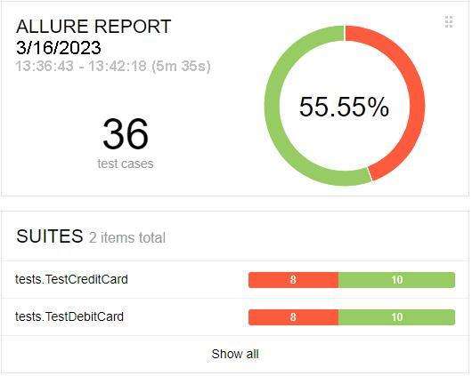
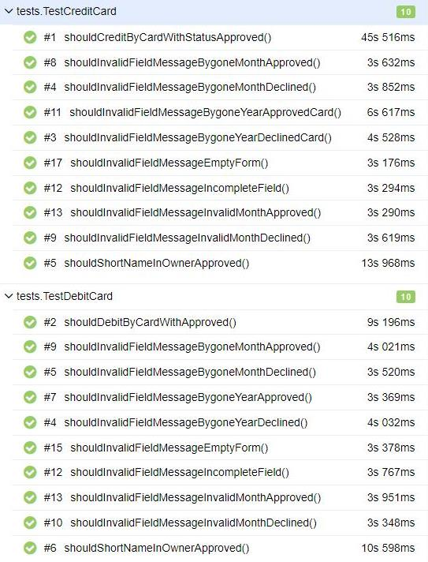
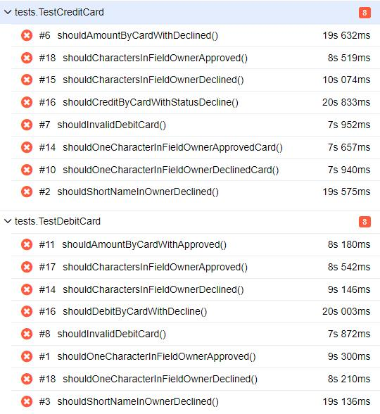

# Отчёт о проведённом тестировании
***
## 1. Краткое описание
При выполнении дипломной работы было проведено автоматизированное тестирование веб-сервиса "Путешествие дня", которое представляет собой комплексный сервис, взаимодействующий с СУБД и API Банка.
1. На первом этапе было проведено исследовательское тестирование и составлен [план автоматизации](https://github.com/SKS81/DiplomProject/blob/main/documents/Plan.md).
2. На втором этапе была произведена автоматизация тестовых сценариев.
3. На третьем этапе были составлены отчеты о проведенном тестировании.
***
## 2. Количество тест-кейсов

- Всего тест-кейсов: **36**

- Успешных тест-кейсов: **20**

- Неуспешных тест-кейсов: **16**

***
## 3. Процентное соотношение успешных/неуспешных тест-кейсов
- Успешные: **55.55%**
- Неуспешные: **44.44%**
***
## 4. Общие рекомендации
1. Устранить [выявленные дефекты](https://github.com/SKS81/DiplomProject/issues).
2. Добавить уникальные идентификаторы для элементов страниц _(test-id)_ для упрощения поиска требуемых селекторов.
3. Составить понятную и подробную документацию к приложению.